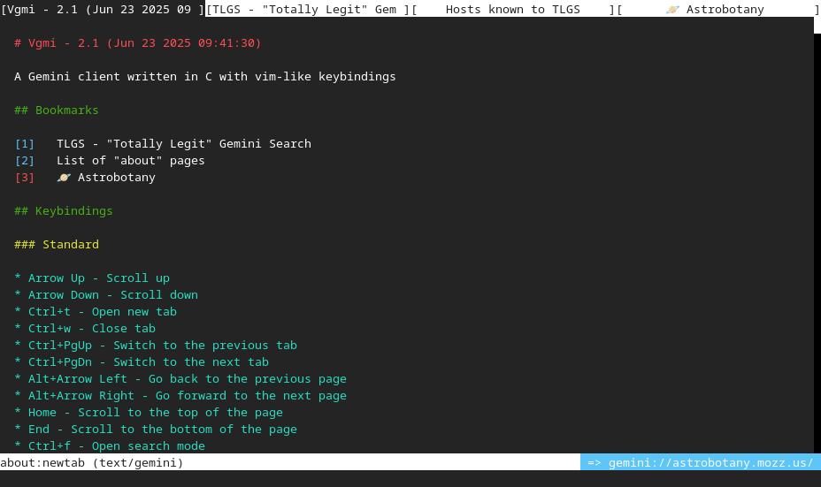

# Vgmi

[Gemini][0] client written in C with vim-like keybindings.

## Keybindings

Standard | Vim | Action
--- | --- | ---
Up Arrow | k | Scroll up
Down Arrow | j, Enter | Scroll down
Ctrl+t | \- | Open a new tab
Ctrl+w | \- | Close the current tab
Ctrl+PgUp | gT | Switch to the previous tab
Ctrl+PgDn | gt | Switch to the next tab
Alt+Left | h | Go back to the previous page
Alt+Right | l | Go forward to the next page
Home | gg | Scroll to the top of the page
End | G | Scroll to the bottom of the page
Ctrl+f | / | Open search mode
\- | : | Open input mode
\- | u  | Open input mode with the current URL
Ctrl+b | \- | Open about:bookmarks in a new tab
Ctrl+h | \- | Open about:history in a new tab
Ctrl+r, F5 | \- | Reload the page
Ctrl+g | n | Jump to next search occurrence
\- | N | Jump to previous search occurrence
\- | [number]Tab | Select link
Left mouse | Tab | Open link
Middle mouse | Shift+Tab | Open link in a new tab

You can prefix a movement key with a number to repeat it.

## Commands

Command | Description
--- | ---
:q | Close the current tab
:qa	| Close all tabs, exit the program
:e | Refresh the page
:o [URL] | Open an URL
:s [search] | Search the Geminispace using the default search engine
:nt [URL] | Open a new tab, the URL is optional
:add [name] | Add the current URL to the bookmarks, the name is optional
:[number] | Scroll to the line number
:gencert | Generate a client-certificate for the current capsule
:forget [host] | Forget the certificate for the host
:download [name] | Download the current page, the name is optional
:exec | Open the current page in an external program
:help | Open about:help in a new tab

## Sandboxing

### FreeBSD
On FreeBSD, Vgmi uses [capsicum(4)][1] to limit the filesystem and to enter
capability mode, it also uses [cap_net(3)][2] for networking while in capability
mode.

### OpenBSD
On OpenBSD, Vgmi uses [unveil(2)][3] to limit access to the filesystem and
[pledge(2)][4] to restrict the capabilities of the program.

### Linux
On Linux, Vgmi uses [seccomp(2)][5] to restrict system calls and
[landlock(7)][6] to restrict the filesystem.

### Illumos and Solaris
On Illumos and Solaris, Vgmi uses [privileges(7)][7] to isolate the
parser processes.

In addition to sandboxing the main process, Vgmi forks itself to parse foreign data
in completely isolated and sandboxed processes.

## Dependencies

* [LibreSSL][8] - fork of OpenSSL developed by the OpenBSD project
* [termbox2][9] - terminal rendering library

### Optional dependency
* [stb-image][10] - image loading library

## Building

Executing the build.sh script will download all dependencies and build Vgmi.

[0]: https://geminiprotocol.net/
[1]: https://www.freebsd.org/cgi/man.cgi?query=capsicum
[2]: https://www.freebsd.org/cgi/man.cgi?query=cap_net
[3]: https://man.openbsd.org/unveil
[4]: https://man.openbsd.org/pledge
[5]: https://man7.org/linux/man-pages/man2/seccomp.2.html
[6]: https://man7.org/linux/man-pages/man7/Landlock.7.html
[7]: https://www.illumos.org/man/7/privileges
[8]: https://www.libressl.org/
[9]: https://github.com/termbox/termbox2
[10]: https://github.com/nothings/stb/blob/master/stb_image.h
