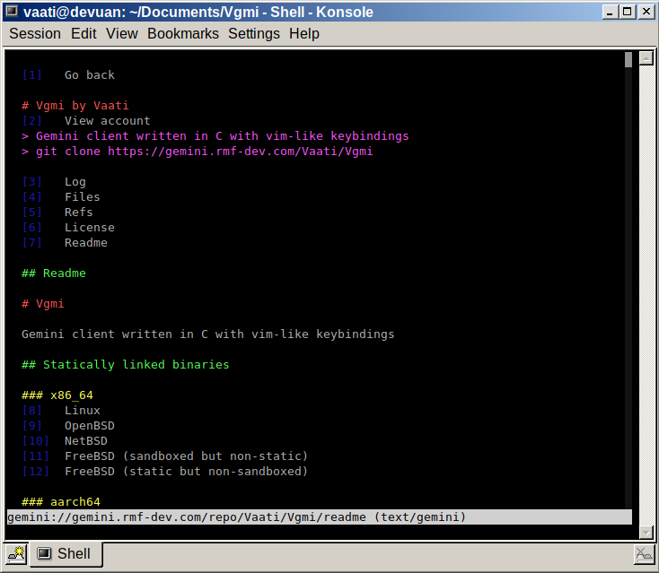

# Vgmi

[Gemini][0] client written in C with vim-like keybindings.

## Keybindings

* k  - Scroll up
* j  - Scroll down
* gT  - Switch to the previous tab
* gt  - Switch to the next tab
* H  - Go back in history
* L  - Go forward in history
* gg - Go at the top of the page
* G  - Go at the bottom of the page
* /  - Open search mode
* :  - Open input mode
* u  - Open input mode with the current url
* b - Open about:bookmarks in a new tab
* f - Open about:history in a new tab
* r  - Reload the page
* [number]Tab  - Select link
* Tab  - Follow selected link
* Shift+Tab  - Open selected link in a new tab

You can prefix a movement key with a number to repeat it.

## Commands

* :q			    - Close the current tab
* :qa			    - Close all tabs, exit the program
* :o [url]		    - Open an url
* :s [search]	    - Search the Geminispace using geminispace.info
* :nt [url]		    - Open a new tab, the url is optional
* :add [name]       - Add the current url to the bookmarks, the name is optional
* :[number]		    - Scroll to the line number
* :gencert		    - Generate a client-certificate for the current capsule
* :forget [host]	- Forget the certificate for the host
* :download [name]	- Download the current page, the name is optional
* :help         	- Open about:help in a new tab

## Sandboxing

### FreeBSD
On FreeBSD, Vgmi uses [capsicum][1](4) to limit the filesystem and to enter
capability mode, it also uses [cap_net][2](3) for networking while in capability
mode.

### OpenBSD
On OpenBSD, Vgmi uses [unveil][3](2) to limit access to the filesystem and
[pledge][4](2) to restrict the capabilities of the program.

### Linux
On Linux, Vgmi uses [seccomp][5](2) to restrict system calls and
[landlock][6](7) to restrict the filesystem.

### Illumos and Solaris
On Illumos and Solaris, Vgmi uses [privileges][7](7) to isolate the
parser processes.

On top of sandboxing the main process, Vgmi forks itself to parse foreign data
in completely isolated and sandboxed processes.

## Dependencies

* [LibreSSL][8] - fork of OpenSSL developed by the OpenBSD project
* [termbox2][9] - terminal rendering library

### Optional dependency
* [stb-image][10] - image loading library

## Building

Executing the build.sh script will download all dependencies and build Vgmi.

[0]: https://gemini.circumlunar.space/
[1]: https://www.freebsd.org/cgi/man.cgi?query=capsicum
[2]: https://www.freebsd.org/cgi/man.cgi?query=cap_net
[3]: https://man.openbsd.org/unveil
[4]: https://man.openbsd.org/pledge
[5]: https://man7.org/linux/man-pages/man2/seccomp.2.html
[6]: https://man7.org/linux/man-pages/man7/Landlock.7.html
[7]: https://www.illumos.org/man/7/privileges
[8]: https://www.libressl.org/
[9]: https://github.com/termbox/termbox2
[10]: https://github.com/nothings/stb/blob/master/stb_image.h
